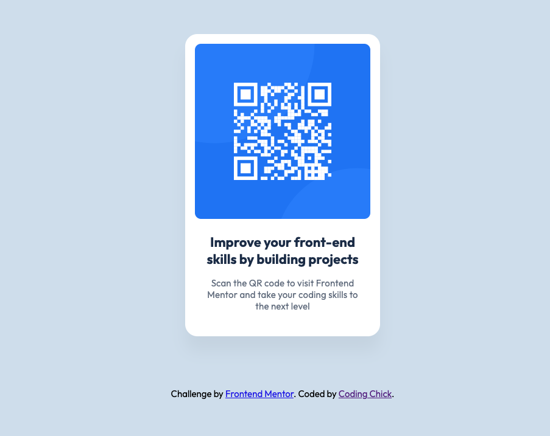
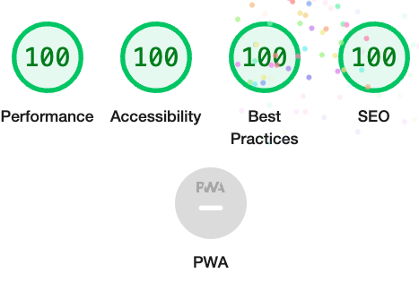

# Frontend Mentor - QR code component solution<!-- omit in toc -->

## Table of contents<!-- omit in toc -->

- [Overview](#overview)
  - [Links](#links)
  - [Built with](#built-with)
- [Accessibility report](#accessibility-report)
- [Author](#author)

## Overview

### Links

- [GitHub repo](https://github.com/awesomeCoding999/frontend-mentor-QR-code-component)
- [Live site](https://awesomecoding999.github.io/frontend-mentor-QR-code-component/)

### Built with

- Semantic HTML5 markup
- CSS custom properties
- mobile first design

## Accessibility report

## Author

- Frontend Mentor - [@awesomeCoding999](https://www.frontendmentor.io/profile/awesomeCoding999)
